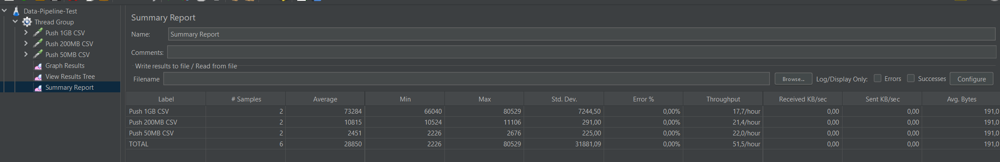

# Data Pipeline Project

## Overview
This project is a data pipeline application that uses Spring Boot and Apache Kafka to process and send data. It reads data from a file and sends it to a Kafka topic.

## Technologies Used
- Java 17
- Spring Boot 3.2.8
- Apache Kafka
- Zookeeper
- Docker
- Maven

## Getting Started
- Clone the repository:  <pre>git clone git@github.com:HoHaiNam-Dev/MoMo_Test.git</pre>

## Project Structure
- `pom.xml`: Maven configuration file.
- `src/main/resources/application.yml`: Contains the application properties.
- `src/main/java/com/momo_homework/data_pipeline/DataPipelineApplication.java`: Main class for running the application.
- `src/main/java/com/momo_homework/data_pipeline/config/`: Contains the configuration classes.
- `src/main/java/com/momo_homework/data_pipeline/controller/DataPipelineController.java`: Contains the REST controller for sending data.
- `src/main/java/com/momo_homework/data_pipeline/service/datapipeline/`: Contains the service classes for processing and sending data.
- `src/main/java/com/momo_homework/data_pipeline/service/file/`: Contains the service classes for reading data from a file.
- `src/main/java/com/momo_homework/data_pipeline/service/kafka`: Contains the service classes for sending data to a Kafka topic.
- `src/main/java/com/momo_homework/data_pipeline/domain/`: Contains the domain classes.
- `src/main/java/com/momo_homework/data_pipeline/utils/enums/`: Contains the enums.
- `src/main/java/com/momo_homework/data_pipeline/utils/errors/`: Contains the handling errors classes.
- `Dockerfile`: Contains the Docker commands to build application into a Docker image.
- `docker-compose.yml`: Contains the Docker Compose configuration to run the application and Kafka.

## Prerequisites
- Java 17
- Maven
- Apache Kafka
- Docker (Optional)

## Running the Application
### Option 1: Run the application using the command line.
1. Navigate to the project directory.
2. Build the project using Maven: <pre>mvn clean install</pre>
3. Run the application: <pre>mvn spring-boot:run</pre>

### Option 2: Run the application using an IDE.
1. Import the project into your IDE.
2. Run the `DataPipelineApplication` class.

### Option 3: Run the application using docker-compose.
1. Navigate to the project directory.
2. Make sure you have Docker and Docker Compose installed. 
3. Run the following command: <pre>docker-compose up -d</pre>

## Design Decisions

#### 1. File Processing with Buffered Reading:
   - **Reasoning**:
     - **Memory Efficiency**: Buffered reading allows the application to read large files line by line without loading the entire file into memory. This is crucial when dealing with large datasets, as it prevents out-of-memory errors and ensures that the application can handle files of varying sizes.
     - **Performance**: Buffered reading improves I/O performance by minimizing the number of I/O operations. Instead of reading a single character or line from the file at a time, the BufferedReader reads chunks of data into an internal buffer and then serves it to the application. This reduces the overhead associated with disk I/O and makes file processing more efficient.
     - **Scalability**: By processing data in a streaming manner, the application can scale to handle very large files without requiring proportional increases in memory. This design choice ensures that the application remains responsive and performant, even when processing large volumes of data.
   - **Implementation**: 
     - Application uses BufferedReader to read each line of the file. After reading a line, it is immediately processed and sent to Kafka, and the memory associated with that line is released, keeping the memory footprint low.

### 2. Concurrent Processing with Executor Service:
   - **Reasoning**:
     - **Parallelism**: By using an ExecutorService with multiple threads, the application can process multiple lines concurrently, improving throughput and performance. This is particularly beneficial when dealing with multi-core processors, as it allows the application to utilize the available resources more effectively.
     - **Asynchronous Processing**: ExecutorService enables asynchronous processing of data, allowing the application to process lines independently of each other. This decoupling of processing tasks improves responsiveness and ensures that the application can handle multiple requests simultaneously.
     - **Resource Management**: ExecutorService manages the lifecycle of threads, including creation, execution, and termination. This simplifies thread management and ensures that resources are used efficiently.
   - **Implementation**:
     - Thread Pool for File Processing: The application uses a thread pool to manage the processing of multiple files concurrently. This allows for better resource utilization and faster processing when dealing with multiple files.
     - Chunked Processing: The application reads and processes files in chunks. Each chunk is processed by a separate thread, improving throughput and allowing the application to scale with increasing data volumes.
   
#### 3. Integration Messaging with Apache Kafka:
   - **Reasoning**:
     - **Reliability**: Kafka provides a reliable and fault-tolerant messaging system that ensures data is not lost even in the event of failures. By sending data to Kafka, the application can guarantee that the data is safely stored and can be consumed by downstream systems.
     - **Scalability**: Kafka is designed to handle large volumes of data and can scale horizontally to accommodate increased throughput. This makes it well-suited for processing and streaming data in real-time.
     - **Asynchronous Processing**: By decoupling the data processing from the data sending, the application can leverage Kafka’s asynchronous messaging model to improve performance and responsiveness. This allows the application to process data at its own pace without being blocked by the Kafka producer.
     - **Real-time Processing**: Kafka enables real-time data processing by allowing data to be streamed to consumers as soon as it is produced. This ensures that downstream systems can consume the data in near real-time, enabling timely insights and actions.
   - **Implementation**:
     - Kafka Producer: The application includes a Kafka producer service that sends processed data to a specified Kafka topic. Each line from the file is sent as a separate message, ensuring that the data is streamed to Kafka in real-time.
     - Specified Kafka Properties: The application uses Kafka properties defined in the `application.yml` file to configure the Kafka producer.
       - `linger: 100`: This property specifies the amount of time (in milliseconds) the producer should wait before sending a batch of messages. A higher value can improve throughput by batching messages together.
       - `batch-size: 65536` (64 KB): This property specifies the maximum size of a batch of messages in bytes. By batching messages together, the producer can reduce the number of requests sent to Kafka, improving performance.
       - `buffer-memory: 33554432` (32 MB): This property specifies the total amount of memory available to the producer for buffering messages before they are sent to Kafka. A larger buffer size can improve performance by allowing the producer to accumulate more messages before sending them.
       - `acks: 1`: This property specifies the number of acknowledgments the producer requires from the broker before considering a message as sent. An acknowledgment value of 1 ensures that the message is successfully written to the leader broker but does not wait for replication to other brokers. This provides a balance between reliability and performance.
     - Retry Mechanism: To handle potential connectivity issues with Kafka, a retry mechanism is implemented using Spring’s @Retryable annotation. This ensures that the application can recover from transient failures without losing data.

#### 4. Optimizations and Scalability:
   - **Memory Usage**:
     - Minimizing Object Creation: The application minimizes unnecessary object creation within loops to optimize memory usage. For instance, variables are reused, and only essential data is retained in memory.
     - Avoiding Full File Load: By processing the file line by line, the application avoids loading the entire file into memory, which is particularly important when dealing with the file size may range from a few MBs to several hundred GBs.
   - **Dockerization**:
     - Multi-stage Dockerfile: The Dockerfile is designed with a multi-stage build process. The first stage builds the application using Maven, while the second stage creates a lightweight runtime image using Alpine Linux. This results in smaller and more efficient Docker images.
     - Docker Compose Integration: Docker Compose is used to orchestrate the application along with Kafka and Zookeeper. This setup simplifies deployment and ensures that all necessary services are up and running with minimal manual intervention.
     - Scalability: The application can be easily scaled by running multiple instances of the Docker container. Kafka’s partitioning mechanism ensures that messages are evenly distributed across partitions, allowing the application to scale horizontally to handle increased throughput.

## Testing Report
- Testing sample data:
  - 50MB file
  - 200MB file
  - 1GB file
- 

